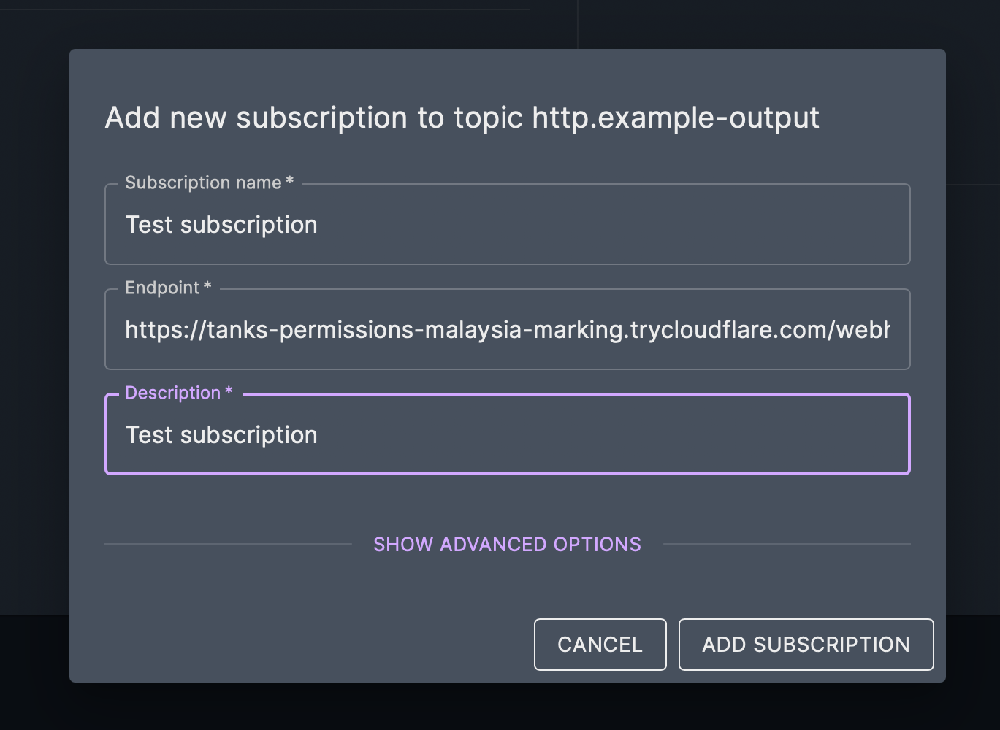

# Nu Cloud Lab

A development toolkit for experimenting with [Nu Cloud](https://cloud.nussknacker.io/), providing ready-to-use producers and consumers in multiple programming languages.

## 🌟 Features

- **Modern CLI Tool** - Unified TypeScript CLI with interactive setup and dry-run mode
- Multiple implementation options:
  - **CLI** (recommended) - TypeScript-based command-line tool
  - Python implementation (legacy)
  - Node.js implementation (legacy)
- Docker support for environment-independent execution
- Flexible message production with customizable templates
- Secure webhook consumption via Cloudflare tunnels
- Easy configuration and setup

## 🆕 CLI Tool (Recommended)

We now offer a unified CLI tool that provides the best developer experience:

### Installation

```bash
# Install globally
npm install -g @nussknacker/cli

# Or use from the cli/ directory
cd cli
npm install
npm run build
npm link
```

### Quick Start

```bash
# 1. Initialize configuration (interactive)
nu-cloud init

# 2. Start consuming messages
nu-cloud consume

# 3. Start producing messages
nu-cloud produce

# Other useful commands
nu-cloud schema              # Generate Avro schema
nu-cloud produce --dry-run   # Preview messages without sending
nu-cloud produce --once      # Send single message
nu-cloud --help              # Show all commands
```

See [`cli/README.md`](./cli/README.md) for complete CLI documentation.

---

## 🚀 Legacy Scripts (Python & Node.js)

The following instructions are for the legacy standalone scripts. **We recommend using the CLI tool above for new projects.**

### Prerequisites

- Python 3.x (for Python implementation) **OR**
- Node.js (for Node.js implementation) **OR**
- Docker (for containerized execution)

When running directly (without Docker):
- The consumer requires `cloudflared` to create secure tunnels
  (The scripts will attempt to install it automatically if missing)

### Data Flow

The typical flow of data in this setup is:
1. **Producer** → Sends messages to Nu Cloud
2. **Nu Cloud** → Processes messages (filtering, transformations, etc.)
3. **Consumer** → Receives messages processed by Nu Cloud via webhook

### Setting Up the Consumer

1. Choose your preferred implementation directory (`python/consumer` or `node.js/consumer`)
2. Run the consumer:

```bash
# Direct execution
./run_consumer.sh

# OR using Docker
./run_consumer_sh_in_docker.sh
```

3. Copy the generated webhook URL into Nu Cloud Add Subscription window


### Setting Up the Producer

1. Navigate to your chosen implementation directory (`python/producer` or `node.js/producer`)
2. Create and configure `config.yaml`:
```bash
cp config.yaml.template config.yaml
```

3. Edit `config.yaml` with your Nu Cloud credentials:
```yaml
api:
  url: "your_nu_cloud_api_endpoint"
  username: "publisher"
  password: "your_password"

producer:
  delay_seconds: 1
```

4. Run the producer:
```bash
# Direct execution
./run_producer.sh

# OR using Docker
./run_producer_in_docker.sh
```

## 📝 Configuration

### Producer Configuration
The producer requires configuration in `config.yaml`. See the template here:

```yaml
# API Configuration
api:
  url: "https://your-api-url.cloud.nussknacker.io/topics/your-topic"
  username: "publisher"
  password: "your_password"

# Producer Configuration
producer:
  delay_seconds: 1
```

### Consumer Configuration
The consumer automatically generates a webhook URL using Cloudflare tunnels. No additional configuration is needed.

## 🔧 Message Templates

Producers use customizable message templates. Default template:

```javascript
const MESSAGE_TEMPLATE = {
    "name": "random_name",
};
```

Example of a more complex template:

```javascript
const EXAMPLE_MESSAGE_TEMPLATE = {
    user: {
        name: "random_name",
        city: "random_city"
    },
    order: {
        product: "random_product",
        quantity: "random_int(1,5)",
        status: "random_status",
        timestamp: "current_timestamp"
    }
};
```

## 🐳 Docker Support

All components can be run in Docker containers, making Docker the only dependency you need on your system. This is especially useful if:

- You don't want to install Python or Node.js on your machine
- You're experiencing environment-specific issues
- You want a consistent execution environment

Simply use the Docker scripts provided:

```bash
# For consumer
./run_consumer_in_docker.sh

# For producer
./run_producer_in_docker.sh
```

## 🔍 Debugging

- Add `--debug` flag to consumer scripts for detailed logging
- Producer scripts will show validation errors if messages don't match the expected schema

## 📚 Project Structure

```
.
├── cli/                   # Modern CLI tool (recommended)
│   ├── src/
│   │   ├── commands/      # CLI commands
│   │   ├── lib/           # Core logic
│   │   └── utils/         # Utilities
│   ├── package.json
│   └── README.md
│
├── python/                # Legacy Python scripts
│   ├── consumer/
│   │   ├── run_consumer.sh
│   │   ├── run_consumer_in_docker.sh
│   │   └── consumer.py
│   └── producer/
│       ├── run_producer.sh
│       ├── run_producer_in_docker.sh
│       └── producer.py
│
└── node.js/               # Legacy Node.js scripts
    ├── consumer/
    │   ├── run_consumer.sh
    │   ├── run_consumer_in_docker.sh
    │   └── consumer.js
    └── producer/
        ├── run_producer.sh
        ├── run_producer_in_docker.sh
        └── producer.js
```

## 🤝 Contributing

Contributions are welcome! Feel free to:
- Submit bug reports
- Propose new features
- Create pull requests

## 📄 License

This project is open source and available under the Apache License 2.0.

## 🔗 Related Links

- [Nu Cloud Documentation](https://nussknacker.io/documentation)
- [Nussknacker GitHub](https://github.com/nussknacker/nussknacker)

## 💡 Tips

### For CLI Users
1. Use `nu-cloud init` for interactive configuration setup
2. Use `nu-cloud produce --dry-run` to preview messages before sending
3. Use `nu-cloud schema` to generate Avro schemas for your message templates
4. Use `--profile` flag to switch between environments (dev/staging/prod)

### For Legacy Script Users
1. Always check if your message structure matches the expected Avro schema in Nu Cloud
2. Use the `--schema` flag with producers to generate Avro schema for your messages
3. Keep the webhook URL secure as it provides direct access to your consumer
4. Use Docker if you encounter any environment-specific issues

## ❓ Support

For questions and support:
- Create an issue in the GitHub repository
- Consult the [Nu Cloud documentation](https://nussknacker.io/documentation)
